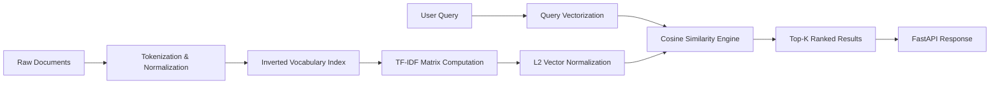

# Semantic Search Lab

<p align="center">
  
  
  
  
</p>

A transparent, lightweight document retrieval engine built from first principles to understand the mechanics behind information retrieval and search pipelines.

Deliberately avoids opaque third-party embedding APIs in favor of an inspectable lexical vector space model. This provides a clean baseline for exploring term weighting, vector normalization, and cosine ranking.

---

## 🧠 Pipeline Architecture



---

## ⚡ Core Concepts Implemented

1. **Inverted Index & Vocabulary Construction**: Builds a unified vocabulary dictionary mapping terms to index dimensions.
2. **TF-IDF Weighting**:
   - Computes normalized term frequencies and inverse document frequencies across the indexed corpus.
3. **Vector Normalization (L2 Norm)**: Ensures documents of varying lengths are fairly compared without length bias:
   $$\hat{v} = \frac{v}{\|v\|_2}$$
4. **Cosine Similarity Ranking**:
   $$\text{sim}(q, d) = \frac{q \cdot d}{\|q\| \|d\|} = \hat{q} \cdot \hat{d}$$
5. **High-Performance API Serving**: Lightweight FastAPI service with `/search`, `/health`, and `/stats` endpoints.

---

## 🚀 Getting Started

### 1. Installation

```bash
git clone https://github.com/amwanshul/semantic-search-lab.git
cd semantic-search-lab

python -m venv venv
# Windows:
.\venv\Scripts\activate
# Linux/macOS:
source venv/bin/activate

pip install -r requirements.txt
```

### 2. Run the API Server

```bash
python app.py
```

The interactive API documentation will be available at `http://127.0.0.1:8000/docs`.

---

## 🔍 API Usage & Examples

### Search Documents (`POST /search`)

**Request:**
```bash
curl -X POST "http://127.0.0.1:8000/search" \
     -H "Content-Type: application/json" \
     -d '{"query": "machine learning optimization", "top_k": 3}'
```

**Response:**
```json
{
  "query": "machine learning optimization",
  "results": [
    {
      "id": 2,
      "text": "Gradient descent is a first-order optimization algorithm for finding a local minimum of a differentiable function in machine learning.",
      "score": 0.6842
    },
    {
      "id": 5,
      "text": "Optimization techniques in deep learning include SGD, Adam, and RMSProp.",
      "score": 0.5129
    }
  ]
}
```

---

## 🧪 Testing

Run the test suite to verify tokenization, vectorization, and ranking logic:

```bash
pytest tests/ -v
```

---

## 📜 License

MIT License.
